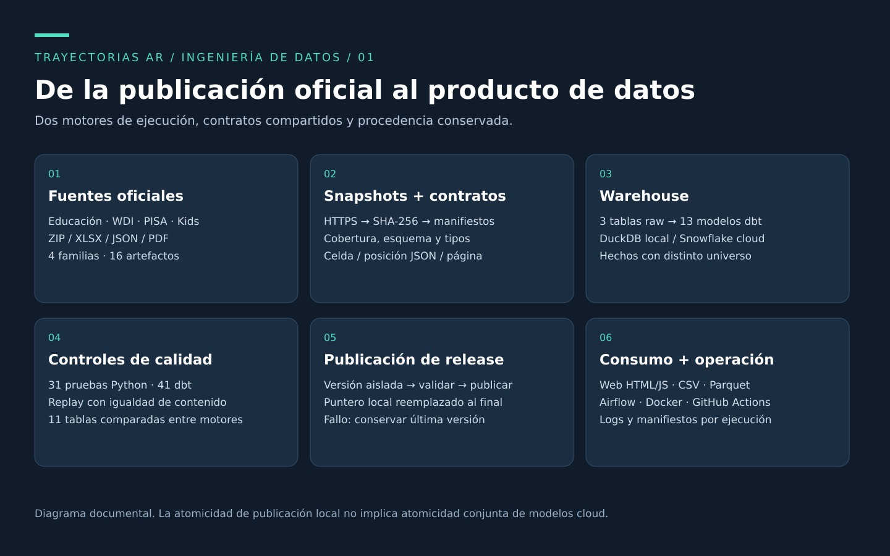
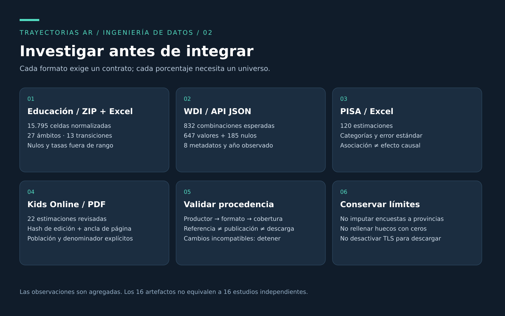
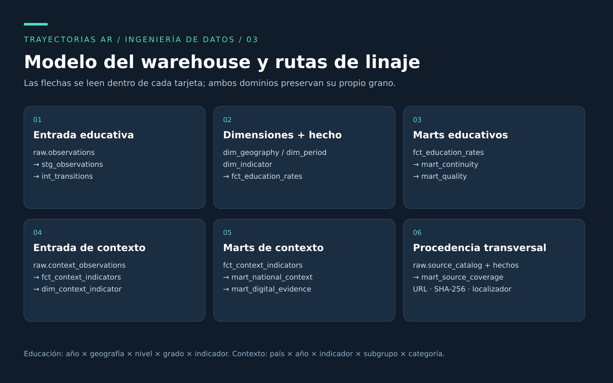
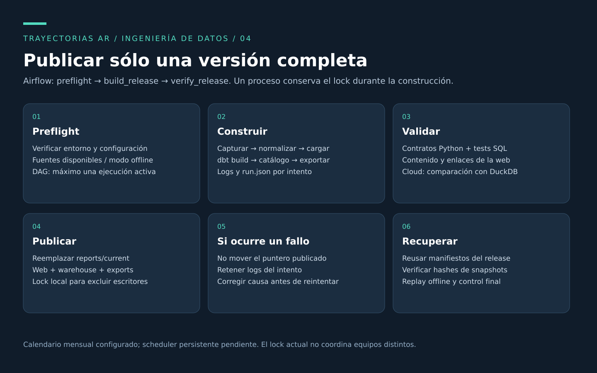
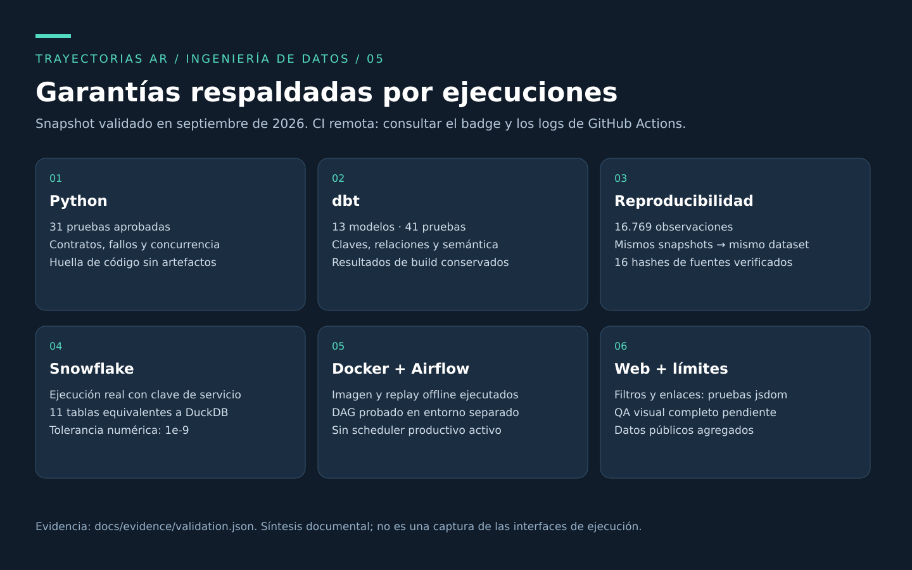

# TrayectoriasAR

**Ingeniería de datos para convertir publicaciones educativas heterogéneas en un warehouse reproducible y auditable.**

[](https://github.com/LautaroFoche/trayectorias-ar/actions/workflows/ci.yml)

Python · SQL · dbt · DuckDB · Snowflake · Airflow · Docker · GitHub Actions

Proyecto de portfolio de **Lautaro Fochesatto**. Integra educación argentina, conectividad y estudios de uso digital. El foco es resolver adquisición, contratos, modelado, calidad, linaje, reproducibilidad y operación. La web HTML/JavaScript es una salida del pipeline y permite inspeccionar datos y procedencia.

## Objetivo

Construir una cadena completa desde fuentes oficiales hasta productos de datos verificables, que pueda ejecutarse sin servicios pagos y también validarse en Snowflake. Cada observación debe conservar su procedencia; una fuente corrupta o un modelo inválido debe impedir la publicación; un replay de los mismos snapshots debe producir el mismo contenido normalizado.

**Alcance validado:** 4 familias de fuentes, 16 artefactos, 16.769 observaciones —incluidos nulos; no son personas—, 3 tablas raw, 13 modelos dbt y 11 tablas exportadas. El volumen es pequeño: el desafío está en la heterogeneidad y las garantías del proceso, no en simular big data.



## Investigación y selección de fuentes

La investigación partió de continuidad escolar en Argentina. Para incorporar contexto digital se evaluaron procedencia institucional, acceso reproducible, formato, granularidad, población, fecha de referencia y limitaciones. El resultado fue una integración multifuente que conserva universos diferentes en hechos separados.

| Fuente | Formato / alcance | Observaciones | Decisión de ingeniería |
|---|---|---:|---|
| [Secretaría de Educación](https://www.argentina.gob.ar/educacion/evaluacion-e-informacion-educativa/indicadores) | ZIP/Excel; 13 transiciones, 2012–2013 a 2024–2025 | 15.795 | Validar hojas, celdas, cobertura y estructura educativa |
| [Banco Mundial WDI](https://api.worldbank.org/v2/) / UIS / ITU | API JSON; 8 indicadores, 4 países, 2000–2025 | 832 | Conservar metadatos, años reales y 185 valores nulos |
| [OECD PISA 2022](https://www.oecd.org/en/publications/pisa-2022-results-volume-ii_a97db61c-en/full-report/component-18.html) | XLSX; 4 países y promedio OECD | 120 | Preservar categorías, errores estándar y localizadores |
| [UNICEF / UNESCO Kids Online](https://www.unicef.org/argentina/informes/kids-online-ninios-ninias-adolescentes-conectados) | 2 PDF; relevamiento 2024, publicación 2025 | 22 | Curación explícita, hash de edición y anclas por página |



Los datos sobre redes e IA se incorporan como contexto: no demuestran por sí mismos deterioro académico. No se distribuyen encuestas nacionales entre provincias, no se promedian tasas sin denominadores y no se mezclan percepciones con resultados medidos. Las tasas educativas fuera de rango se conservan y señalan. Kids Online representa estudiantes de 9–17 años en ciudades de al menos 50.000 habitantes; sus porcentajes condicionados conservan el denominador original.

El [proceso de investigación](docs/INVESTIGACION.md) detalla las decisiones y exclusiones. Ver también [fuentes](docs/FUENTES.md), [diccionario educativo](docs/DATOS.md) y [contratos de contexto digital](docs/CONTEXTO_DIGITAL.md).

## Construcción del warehouse

El modelo educativo tiene grano **año base × geografía × nivel × grado × indicador**. La estructura escolar queda como atributo; la clave determinista identifica la observación independientemente de revisiones de su valor. Las dimensiones geográfica, temporal e indicador alimentan el hecho educativo y los marts de continuidad y calidad.

El hecho de contexto conserva país, año, indicador, subgrupo y categoría, junto con población, denominador, error estándar, método y fuente. Su catálogo de procedencia es compartido; no existe una unión estadística artificial con las provincias.



| Capa | Implementación | Responsabilidad |
|---|---|---|
| Snapshots | Archivos direccionados por SHA-256 y manifiestos | Conservar versiones exactas de entrada |
| Raw | `observations`, `context_observations`, `source_catalog` | Cargar registros normalizados y procedencia |
| Staging / intermediate | SQL dbt | Tipado, estados de valor y contexto de transiciones |
| Marts | Dimensiones, hechos, continuidad, calidad y contexto | Ofrecer contratos de consumo estables |
| Publicación | Web, CSV y Parquet | Distribuir once tablas y sus evidencias |

Se eligió **full rebuild** porque las fuentes revisan históricos y el tamaño permite reconstruir con bajo costo. No se presenta como carga incremental. DuckDB facilita la reproducción; el perfil Snowflake ejecuta los mismos modelos. [Arquitectura y decisiones](docs/ARQUITECTURA.md).

## Pipeline, calidad y recuperación

1. Descarga HTTPS con timeout, reintentos y límites; captura snapshots y hashes.
2. Normalización con contratos por formato; rechaza cambios incompatibles y conserva nulos semánticos.
3. Carga en una base aislada; ejecución de `dbt build` y generación del catálogo.
4. Exportación y construcción de la web sólo si pasan los controles.
5. Publicación mediante reemplazo atómico del enlace `reports/current`.



Un bloqueo local evita escritores simultáneos. Un fallo mantiene la última publicación válida y registra el intento. Airflow organiza `preflight → build_release → verify_release`, con reintentos y una ejecución activa; el calendario mensual está definido, pero no hay scheduler productivo persistente.

Las pruebas cubren corrupción de fuentes, cambios de esquema, duplicados, cobertura, nulos, comparabilidad, denominadores, concurrencia y preservación de la versión publicada. El replay compara hashes de fuentes y dataset; no exige archivos DuckDB o Parquet binariamente idénticos.

## Evidencia de ejecución



- **Python:** 29 pruebas aprobadas; **dbt:** 13 modelos y 41 pruebas.
- **Docker:** imagen construida y replay offline validado contra el dataset local.
- **Snowflake:** carga real y comparación de las 11 tablas con DuckDB, tolerancia numérica `1e-9`.
- **Web:** pruebas funcionales de filtros, nulos, denominadores y enlaces mediante jsdom. QA visual completo en escritorio/móvil pendiente.
- **CI:** el badge enlaza el estado remoto actual; la integración descarga fuentes oficiales y verifica replay offline.

Las imágenes son diagramas documentales y una síntesis de controles, **no capturas de interfaces**. Se regeneran con `python scripts/build_portfolio_assets.py`; el resumen público usa una lista explícita de campos permitidos y excluye logs de autenticación. [Evidencia verificable](docs/VALIDACION.md) · [resumen JSON](docs/evidence/validation.json).

## Reproducir desde un clon limpio

Requisitos: Linux/WSL, Git, `make`, `curl`, `uv` y `pdftotext` (`poppler-utils`). Python 3.13 se administra con uv; Node.js 22 sólo para pruebas web.

```bash
git clone https://github.com/LautaroFoche/trayectorias-ar.git
cd trayectorias-ar
make setup
make test
make run                      # primera descarga; necesita Internet
npm ci --ignore-scripts
npm run test:web
.venv/bin/python scripts/check_reproducibility.py
make serve                    # http://127.0.0.1:8765/dashboard.html
```

Los snapshots y credenciales no se distribuyen en Git. `make offline` requiere una primera descarga exitosa. Si un productor cambia un contrato o el PDF revisado, el pipeline debe fallar hasta revisar la nueva edición.

```bash
# Docker: pipeline DuckDB y servidor web local
mkdir -p data reports
docker compose run --build --rm pipeline
docker compose up -d report
# http://127.0.0.1:8080/current/dashboard.html

# Airflow: entorno separado y prueba del DAG, sin scheduler permanente
make airflow-setup airflow-check airflow-test
```

[Operación y recuperación](docs/OPERACION.md) · [configuración Snowflake](docs/SNOWFLAKE.md). La ruta cloud requiere una cuenta propia, autenticación por clave externa y presupuesto: warehouse X-Small, autosuspensión y monitor de recursos. La ejecución Snowflake validada corre en el host; Docker ejecuta DuckDB. Consultar la web estática no consume consultas cloud.

## Mapa del repositorio

```text
config/            URLs, contratos e indicadores revisados
src/trayectorias/  Ingesta, normalización, pipeline y web
dbt/              Modelos, fuentes y pruebas SQL
orchestration/     DAG Airflow
infra/             Aprovisionamiento Snowflake
scripts/           Replay, comparación cloud, controles y documentación
tests/             Pruebas Python
.github/workflows/ Integración continua
docs/              Investigación, arquitectura, operación y evidencias
```

## Seguridad, límites y evolución

El repositorio contiene código, configuración pública y evidencia agregada. No contiene claves, contraseñas, identificadores de cuenta, sesiones ni datos individuales de estudiantes. Los artefactos operativos permanecen fuera de Git. [Política de seguridad](SECURITY.md).

No es un despliegue productivo: faltan coordinación distribuida, publicación conjunta de modelos cloud, alertas y retención automatizada. El monitor no constituye un límite exacto de gasto. Los próximos pasos están priorizados en [TODO.md](TODO.md), con criterios de aceptación.

[Texto para LinkedIn](docs/LINKEDIN.md) · [guía para presentar el proyecto](docs/PORTFOLIO.md).

Código bajo [MIT](LICENSE). Los datos conservan las condiciones de sus productores: [DATA_NOTICE.md](DATA_NOTICE.md).
