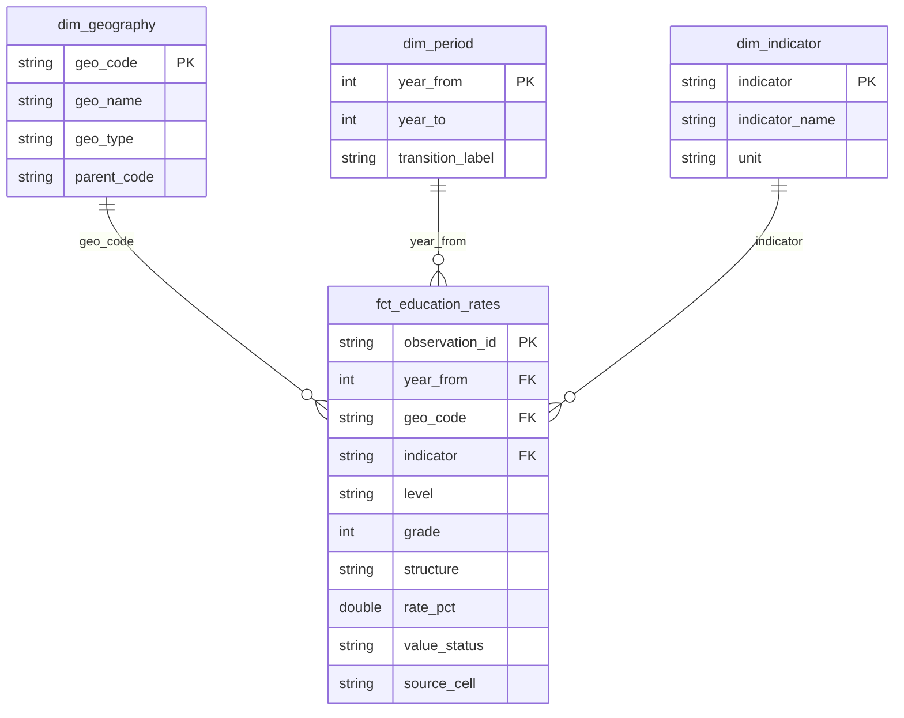

# Arquitectura y decisiones

## Capas y contratos

1. **Fuentes:** `config/sources.json` fija tres URLs oficiales. La descarga usa HTTPS, límite de tamaño, timeout y reintentos. Un ZIP inválido detiene la ejecución.
2. **Bronze:** `data/raw/<indicador>/<sha256>.zip` es inmutable por contenido. `manifest.json` registra URL, tamaño, hash y momento de descarga. Una actualización conserva la versión anterior. El archivo `sources.json` de cada release fija exactamente el manifiesto usado.
3. **Normalización:** Python selecciona un único libro provincial y verifica hojas, encabezados, años consecutivos, 27 ámbitos, estructuras, valores numéricos y claves únicas. Conserva los nulos con su significado. Genera observaciones y notas de las fuentes.
4. **Raw warehouse:** una base aislada por ejecución recibe el snapshot validado dentro de una transacción.
5. **dbt:** staging renombra y tipa semánticamente; intermediate agrega contexto; marts produce dimensiones, hechos, continuidad y calidad. No depende de paquetes dbt externos.
6. **Publicación:** dbt build debe pasar antes de exportar. Se genera catálogo dbt, CSV, Parquet, HTML y evidencia. Un `os.replace` cambia el enlace `reports/current` sólo después de completar todo.

## Modelo dimensional

La estructura educativa se conserva en el hecho porque puede variar por año. `level` y `grade` son dimensiones degeneradas de este alcance. `observation_id` es SHA-256 de año base, código territorial, nivel, grado e indicador; el hash de contenido de fuente es independiente para detectar revisiones de valores.

## Decisiones (ADR)

| Decisión | Motivo y alternativa descartada |
|---|---|
| DuckDB local, Snowflake opcional | Demostración reproducible sin credenciales; conserva SQL portable y el perfil cloud |
| Full rebuild por release | 16.769 observaciones; facilita correcciones históricas y publicación consistente. MERGE añadiría complejidad sin beneficio actual |
| dbt por capas | Linaje explícito, reglas SQL revisables y pruebas que bloquean la publicación |
| Python para Excel | Encabezados combinados, hojas y notas exigen un contrato específico; no basta `read_csv` |
| Atomicidad con un puntero | Un lector resuelve una versión completa. Cada solicitud HTTP puede resolver una nueva versión; no garantiza una sesión web fijada durante un cambio |
| Un task de Airflow para la construcción | Mantiene dentro del mismo proceso el bloqueo y la publicación atómica; preflight y verificación son tareas independientes |
| Sin promedios provinciales | Faltan denominadores de matrícula; se utiliza el total nacional oficial |
| Sin recortar tasas | Los valores fuera del rango teórico son parte de la publicación y no necesariamente corrupción |

## Idempotencia, concurrencia y fallos

Con los mismos snapshots y código, las observaciones tienen claves y hash de dataset estables. Las ejecuciones crean releases distintos con timestamps distintos; no se promete igualdad binaria del archivo DuckDB ni de Parquet. Un bloqueo `flock` impide escritores simultáneos en esta máquina. No es un lock distribuido.

Un error de contrato, de carga o de dbt deja `reports/current` intacto y conserva evidencia del intento en `reports/runs`. El manifiesto de ingesta puede ya apuntar a archivos nuevos rechazados: la fuente autoritativa de una versión publicada siempre es su propio `sources.json`. No existe cuarentena por fila: falla el snapshot completo para evitar publicar cobertura parcial.

## Límites de despliegue

La ruta Snowflake reemplaza tres tablas raw con DELETE/INSERT en una transacción y ejecuta dbt. Se validó contra una cuenta real y compara once tablas con DuckDB antes de publicar la web cloud. Los modelos cloud no cambian atómicamente como conjunto. Para producción se necesitan esquemas de release y coordinación distribuida; el lock actual protege escritores del mismo equipo. Ver SNOWFLAKE.md.
